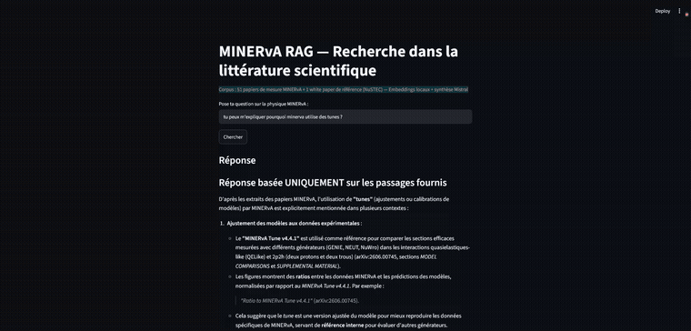

# MINERvA RAG — Recherche dans la littérature scientifique

Système de RAG (Retrieval-Augmented Generation) permettant d'interroger en
langage naturel un corpus de 51 papiers de physique expérimentale
(collaboration MINERvA, Fermilab) et un white paper de référence, avec
réponses sourcées et vérifiables.

**Contexte** : projet portfolio réalisé lors d'une transition d'un poste de
postdoc en physique des hautes énergies (neutrinos, MINERvA/DUNE) vers un
poste d'ingénieur data. L'objectif était de démontrer la conception d'un
pipeline RAG complet et économe, pas de construire un outil de production.



---

## Architecture

```
CSV (liste de papiers, arXiv IDs)
    │
    ▼
scrap_articles.py ──► téléchargement PDF + métadonnées (API arXiv)
    │
    ▼
chunk_papers.py   ──► extraction texte (unstructured + fallback pdfminer)
    │                 découpage en chunks (~500 tokens, par section)
    ▼
                  ──► embeddings locaux (bge-small-en-v1.5)
    │                 indexation dans ChromaDB (persistant, local)
    ▼
app.py (Streamlit) ─► recherche vectorielle (top-8)
    │                 synthèse sourcée via l'API Mistral
    ▼
Réponse + sources citées (arXiv ID, section, lien PDF)
```

Le seul appel payant du pipeline est la synthèse finale (Mistral). Tout le
reste — extraction, chunking, embeddings, recherche — tourne en local,
gratuitement.

---

## Choix techniques et arbitrages

**Chunking en tokens, pas en caractères.** Le découpage utilise `tiktoken`
pour mesurer la taille réelle en tokens (~500 tokens/chunk, overlap 50) —
un premier essai en comptant les caractères produisait des chunks 4x trop
petits, perdant du contexte utile pour l'embedding.

**Extraction avec fallback documenté.** `unstructured` (strategy="fast")
gère bien la détection de structure (titres de section, texte narratif)
sur la majorité des PDF. Sur les papiers contenant des figures
vectorielles très denses (multi-panneaux avec des dizaines de courbes),
une heuristique interne d'`unstructured` bascule vers `hi_res`, qui
échoue silencieusement dans cet environnement (dépendances non
installées) et retourne 0 chunk. Pour ces cas (8 papiers sur 51), le
pipeline retombe sur `pdfminer.six` en extraction texte brute, avec une
étiquette de traçabilité (`extraction_method`) conservée jusque dans les
métadonnées ChromaDB.

**Embeddings locaux (bge-small-en-v1.5).** Choisi pour tourner sans GPU,
sans coût, avec une qualité de retrieval suffisante pour ce volume
(~2500 chunks). Le modèle est mis en cache localement après le premier
téléchargement.

**Deux types de documents distingués (`doc_type`).** Le corpus mélange des
papiers de mesure primaires (`primary_research`) et un white paper de
référence générale (`background` — NuSTEC White Paper sur les
interactions neutrino-noyau). Cette distinction est propagée jusqu'au
prompt final, pour que le modèle sache différencier une mesure spécifique
d'un contexte pédagogique.

**Mistral plutôt que Claude pour la synthèse finale.** Choix économique
(comparable à Haiku) et démonstratif : le pipeline RAG est agnostique du
provider — seule la fonction d'appel change, tout le reste (recherche,
contexte, prompt) reste identique. Pertinent dans une optique marché
français, où la souveraineté des données pousse une partie du secteur
(banque, secteur public, défense) vers des modèles français/open-weight
plutôt que des API américaines.

**Prompt à deux niveaux de confiance.** Le prompt final sépare
explicitement une réponse basée uniquement sur les sources fournies
(avec citation `arXiv:XXXX.XXXXX` obligatoire) d'une section optionnelle
"Au-delà des sources fournies", pour éviter de faire passer une
extrapolation du modèle pour une affirmation sourcée.

---

## Limites connues

- **8 papiers sur 51 en extraction fallback** (texte brut, sans découpage
  par section) — voir ci-dessus. Accepté comme compromis plutôt que
  d'installer la chaîne de dépendances lourde (`hi_res`/Detectron2) pour
  un gain marginal sur ces cas précis.
- **Pas de reranking.** Le top-8 de la recherche vectorielle est envoyé
  tel quel au LLM, sans étape de reclassement. Un reranker (cross-encoder
  léger) améliorerait probablement la précision sur des questions
  ambiguës, au prix d'une latence supplémentaire.
- **Pas d'expansion de requête automatisée.** Des tests manuels ont montré
  qu'une requête vectorielle enrichie en vocabulaire technique
  (acronymes, noms de générateurs) améliore nettement la pertinence des
  résultats. Une automatisation via un petit modèle local (Ollama,
  Qwen2.5 1.5B) a été identifiée comme piste mais non implémentée
  (blocage d'installation sur l'environnement de dev, jugé hors scope
  pour un projet portfolio).
- **Pas d'architecture agentique.** Le système suit un pipeline RAG fixe
  (une recherche, une synthèse), pas une boucle d'agent capable
  d'itérer, d'élargir sa recherche ou de croiser plusieurs sources de
  façon autonome. Choix délibéré : pour ce volume et ce type de
  question, un agent ajoute du coût et de la latence sans bénéfice net
  démontré (voir *Inspirations* ci-dessous).

---

## Inspirations et projets similaires

Ce projet s'inspire de l'architecture RAG popularisée par des outils comme
[PaperQA2](https://github.com/Future-House/paper-qa) (Future House), une
référence dans le domaine du RAG appliqué à la littérature scientifique.

PaperQA2 va plus loin sur plusieurs points (reranking LLM, RAG agentique
avec requêtes itératives, résumé contextuel par passage) — des pistes
explorées en amont de ce projet (voir *Limites connues*) mais
volontairement laissées hors scope ici. L'objectif était de démontrer la
maîtrise de bout en bout d'un pipeline RAG économe (embeddings locaux, API
seulement en synthèse finale), pas de réimplémenter un outil déjà mature.

---

## Installation et usage

```bash
python3 -m venv venv
source venv/bin/activate
pip install -r requirements.txt
```

**1. Récupérer les papiers** (liste dans `minerva_papers_arxiv.csv`) :
```bash
python scrap_articles.py
```

**2. Chunker et indexer** (idempotent — ne retraite que les nouveaux
papiers ajoutés au CSV) :
```bash
python chunk_papers.py
```

**3. Configurer la clé API Mistral** :
```bash
export MISTRAL_API_KEY="votre_clé"
```

**4. Lancer l'interface** :
```bash
streamlit run app.py
```

---

## Stack

Python · unstructured · pdfminer.six · tiktoken · langchain-text-splitters
· sentence-transformers (bge-small-en-v1.5) · ChromaDB · Mistral AI ·
Streamlit
